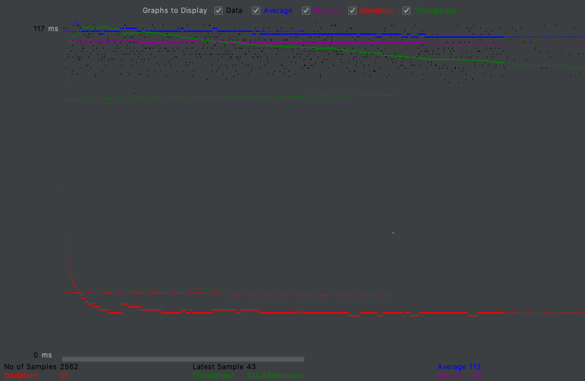

- # General
    - #### Team#: 114
    
    - #### Names: Haoming Gao, Zongchang Lyu
    
    - #### Project 5 Video Demo Link: 

    - #### Instruction of deployment: 
      The method that we deploy our application with tomcat is the same as the first method which professor told in lecture. Our application generate a .war file, after we login 'manager app' at tomcat main page, we add this .war file and deploy it. The detail can also be seen in the demo video above.

    - #### Collaborations and Work Distribution:
        Member 1: Haoming Gao:
        1. Mainly focus on connection pooling, mysql master/slave, tomcat load balancer and Jmeter meaturement.
        2. Finished the Demo video.

        Member 2: Zongchang Lyu:
        1. Mainly focus on connection pooling, mysql master/slave, tomcat load balancer and Log Processing Script.
        2. Finished README file.

      As you can see, many of works are overlapped, because we do not seperate the work precisely, in many part, both of us did a different version, and the final version is just one of them. For more details, it can be check by the commit records.

- # Connection Pooling
    - #### Include the filename/path of all code/configuration files in GitHub of using JDBC Connection Pooling.
    
      AddNewMovieServlet.java: https://github.com/UCI-Chenli-teaching/cs122b-spring20-team-114/blob/58f9c7e1a61c6dfc0fc951a203a5dbc80fa78491/FabFlixWeb/src/AddNewMovieServlet.java

      AddNewStarServlet.java: https://github.com/UCI-Chenli-teaching/cs122b-spring20-team-114/blob/58f9c7e1a61c6dfc0fc951a203a5dbc80fa78491/FabFlixWeb/src/AddNewStarServlet.java

      AutocompleteServelet.java: https://github.com/UCI-Chenli-teaching/cs122b-spring20-team-114/blob/58f9c7e1a61c6dfc0fc951a203a5dbc80fa78491/FabFlixWeb/src/AutocompleteServelet.java

      BrowseServlet.java: https://github.com/UCI-Chenli-teaching/cs122b-spring20-team-114/blob/58f9c7e1a61c6dfc0fc951a203a5dbc80fa78491/FabFlixWeb/src/BrowseServlet.java
      
      CartServlet.java: https://github.com/UCI-Chenli-teaching/cs122b-spring20-team-114/blob/58f9c7e1a61c6dfc0fc951a203a5dbc80fa78491/FabFlixWeb/src/CartServlet.java
      
      DashboardServlet.java: https://github.com/UCI-Chenli-teaching/cs122b-spring20-team-114/blob/58f9c7e1a61c6dfc0fc951a203a5dbc80fa78491/FabFlixWeb/src/DashboardServlet.java
      
      EmpLoginServlet.java: https://github.com/UCI-Chenli-teaching/cs122b-spring20-team-114/blob/58f9c7e1a61c6dfc0fc951a203a5dbc80fa78491/FabFlixWeb/src/EmpLoginServlet.java
      
      HomeServlet.java: https://github.com/UCI-Chenli-teaching/cs122b-spring20-team-114/blob/58f9c7e1a61c6dfc0fc951a203a5dbc80fa78491/FabFlixWeb/src/HomeServlet.java
      
      LoginServlet.java: https://github.com/UCI-Chenli-teaching/cs122b-spring20-team-114/blob/58f9c7e1a61c6dfc0fc951a203a5dbc80fa78491/FabFlixWeb/src/LoginServlet.java
      
      MobileSearch.java: https://github.com/UCI-Chenli-teaching/cs122b-spring20-team-114/blob/58f9c7e1a61c6dfc0fc951a203a5dbc80fa78491/FabFlixWeb/src/MobileSearch.java
      
      MovieListServlet.java: https://github.com/UCI-Chenli-teaching/cs122b-spring20-team-114/blob/58f9c7e1a61c6dfc0fc951a203a5dbc80fa78491/FabFlixWeb/src/MovieListServlet.java
      
      SingleMovieServlet.java: https://github.com/UCI-Chenli-teaching/cs122b-spring20-team-114/blob/58f9c7e1a61c6dfc0fc951a203a5dbc80fa78491/FabFlixWeb/src/SingleMovieServlet.java
      
      SingleStarServlet.java: https://github.com/UCI-Chenli-teaching/cs122b-spring20-team-114/blob/58f9c7e1a61c6dfc0fc951a203a5dbc80fa78491/FabFlixWeb/src/SingleStarServlet.java
      
      paymentInfoServlet.java: https://github.com/UCI-Chenli-teaching/cs122b-spring20-team-114/blob/58f9c7e1a61c6dfc0fc951a203a5dbc80fa78491/FabFlixWeb/src/paymentInfoServlet.java
      
    
    - #### Explain how Connection Pooling is utilized in the Fabflix code.
    
        First, we need to modify the context.xml file to use connection pooling in our code, then every time in the java servelet code we create a new connection, these connections are already created inside the connection pooling, and every time we close it, it is not physically closed the connection, it just put it back to connection pool and waiting to reuse.
    
    - #### Explain how Connection Pooling works with two backend SQL.
        We can set 'cachePrepStmts' to be true in the context.xml file, to avoid inconsistency when using prepare statement.
    

- # Master/Slave
    - #### Include the filename/path of all code/configuration files in GitHub of routing queries to Master/Slave SQL.
        web.xml: https://github.com/UCI-Chenli-teaching/cs122b-spring20-team-114/blob/21bb73c4e65a3276c9481cadabd877e807f3516c/FabFlixWeb/WebContent/WEB-INF/web.xml

    - #### How read/write requests were routed to Master/Slave SQL?
        The write requests can only be routed to master SQL, and the read requests can be routed to both master and slave SQL. Here, we do not using a sql load balancer which give another level of abstraction, we just hard code to make things work properly.

- # JMeter TS/TJ Time Logs
    - #### Instructions of how to use the `log_processing.*` script to process the JMeter logs.
        In our log_processing.py code file, the code first read the JMeter logs files sum up TS and TJ separately and divide them by the total count, then we can get the average TS and TJ.
        To use this script, because it is writen by python, we can just open it using sublime text and run it, then we can get the final result.

- # JMeter TS/TJ Time Measurement Report

| **Single-instance Version Test Plan**          | **Graph Results Screenshot** | **Average Query Time(ms)** | **Average Search Servlet Time(ms)** | **Average JDBC Time(ms)** | **Analysis** |
|------------------------------------------------|------------------------------|----------------------------|-------------------------------------|---------------------------|--------------|
| Case 1: HTTP/1 thread                          |    | 209                         | 13.2693                                  | 6.4425                        | ??           |
| Case 2: HTTP/10 threads                        |    | 210                         | 103.9614                                  | 46.7099                        | ??           |
| Case 3: HTTPS/10 threads                       |    | 314                         | 103.5723                                  | 44.3888                        | ??           |
| Case 4: HTTP/10 threads/No connection pooling  |    | 207                         | 283.8234                                  | 225.7281                        | ??           |

| **Scaled Version Test Plan**                   | **Graph Results Screenshot** | **Average Query Time(ms)** | **Average Search Servlet Time(ms)** | **Average JDBC Time(ms)** | **Analysis** |
|------------------------------------------------|------------------------------|----------------------------|-------------------------------------|---------------------------|--------------|
| Case 1: HTTP/1 thread                          |    | 113                         | 16.3268                                  | 7.2736                        | ??           |
| Case 2: HTTP/10 threads                        |    | 153                         | 48.9252                                  | 21.2482                        | ??           |
| Case 3: HTTP/10 threads/No connection pooling  |    | 152                         | 126.5538                                  | 98.7846                        | ??           |
